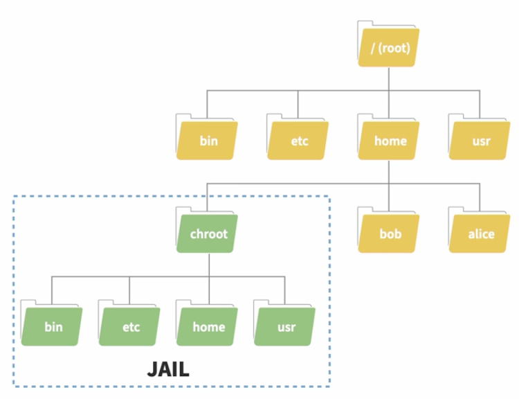
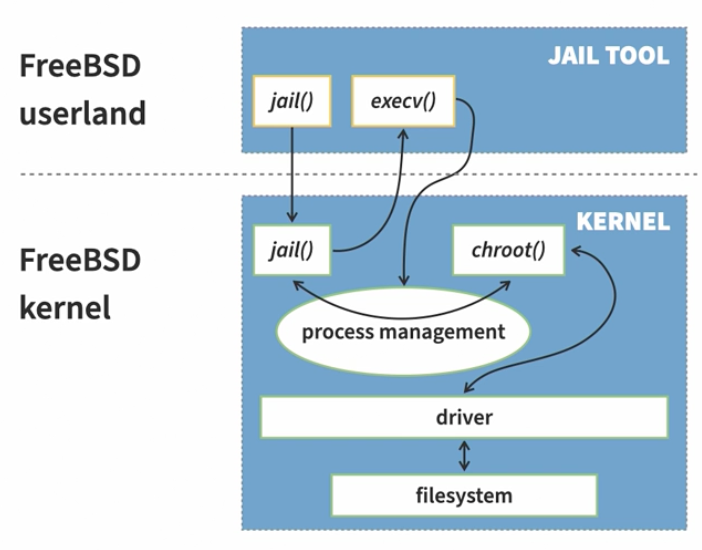

# Learning Docker
#### **By:** Carlos Nunez
Containers help developers pack up their applications, ensuring they run smoothly anywhere. Software developers need to understand these technologies to deliver software as a team. Whether you are new to Docker or looking to review the fundamentals, these courses can help. Tune in, pass the final exam, and earn your certificate.

### Learning objectives
- Define Docker and explain common use cases.
- Understand how containers functionally and operationally differ from virtual machines.
- Explore three key technologies that make Docker different: layered containers, the Dockerfile, and the Docker API.
- Learn how to create and manage containers using the Docker CLI.
- Understand how to create custom container images using Dockerfiles.
- Learn how to push Docker images to the Docker registry and manage them.
- Troubleshoot common container issues using Docker CLI commands.
- Understand common best practices and problems when working with Docker containers and images.

<br>

### Table of contents
- **Docker Explained**
  - What is Docker?
  - Containers vs. virtual machines
  - The anatomy of a container
  - The Docker difference
- **Installing Docker**
  - Docker Desktop
  - Install Docker on a Mac with Docker Desktop
  - Install Docker on Windows with Docker Desktop
  - Install Docker on Linux
- **Using Docker**
  - Exploring the Docker CLI
  - Create a Docker container
  - Create a Docker container: The short way
  - Create a Docker container from Dockerfiles, part 1
  - Create a Docker container from Dockerfiles, part 2
  - Interact with your container
  - Stopping and removing the container
  - Binding ports to your container
  - Saving data from containers
  - Introducing the Docker Hub
  - Pushing images to the Docker registry
  - Checking your images in Docker Hub
  - Challenge: Starting NGINX
  - Solution: Starting NGINX
- **When Things Go Wrong**
  - Help! I can't seem to create more containers
  - Help! My container is really slow
  - Challenge: Fix a broken container
  - Solution: Fix a broken container
- **Additional Docker Resources**
  - Docker best practices
  - Taking it to the next level with Docker Compose
  - Level up even more with Kubernetes

<br><br><br>

## Docker Explained
### What is Docker?
#### Previous Solutions
- **Configuration managment tools (Chef, Puppet, Ansible)**<br>Require knowledge about hardware and operating system
- **Virtual machines as code (Vagrant)**<br>Heavy, slowish, require inconvenient configuration
#### Docker
Docker uses **images** and **containers** to allow apps to run anywhere, consistently.

<br>

### Containers vs. virtual machines
Containers and virtual machines are often compared, but they differ significantly. Here's a breakdown:

#### Key Differences

| **Area** | **VMs** | **Containers** |
|---|---|---|
|**Virtualization Layer**|Virtualize hardware via a hypervisor | Virtualize the operating system kernel via container runtimes.|
|**Operation**|Operate using a hypervisor that emulates hardware (memory, processors, disks, etc.).| Utilize the host operating system and hardware directly through container runtimes, avoiding emulation.|
|**Setup and Booting**|Require separate installation of operating systems and configuration for each VM.|Share the host's operating system and do not require a boot-up process, leading to faster application startups.|
|**Resource Usage**|Require virtual memory and disks, consuming significant disk space.|Do not need virtual memory or disks, enabling more applications to run simultaneously and using less space.|
|**Application Hosting**|Can host multiple apps simultaneously within one VM.|Designed to run only one app per container.|
|**Security and Isolation**|Apps running on VMs are isolated and cannot interact with the host directly.|Share the host's operating system, allowing visibility and potential modification of the host (a resolved security concern in most cases).|

#### Summary of Advantages
- **Virtual Machines**: Flexibility, isolation, and the ability to emulate a complete computer system.
- **Containers**: Faster startup times, lower resource consumption, and higher density of applications on the same hardware.

<br>

### The anatomy of a container
Containers rely on specific Linux kernel features to function. They consist of two primary components: **Linux Namespaces** and **Linux Control Groups (cgroups)**. Here's a breakdown:

#### Components of a Container

1. **Linux Namespaces**
   - **Purpose**: Provide isolation by exposing different "views" of the system to applications running within the container.
   - **Functionality**: Allow an application to perceive it has access to a full system while limiting actual access.
   - **Types of Namespaces**:
     |Namespace|Description|
     |---|---|
     |**USERNS**| Manages user views and permissions |
     |**MOUNT**| Controls file system access |
     |**NET**| Manages network communication capabilities |
     |**IPC**| Handles interprocess communication |
     |**TIME**| Controls the ability to modify time settings (not used by Docker containers) |
     |**PID**| Manages process IDs |
     |**CGROUP**| Controls creation and listing of control groups |
     |**UTS**| Manages host and domain names |
   - **Docker Limitation**: Docker uses all namespaces except for the TIME namespace.

2. **Linux Control Groups (cgroups)**
   - **Purpose**: Restrict and monitor hardware resource usage per process.
   - **Functions**:
     - Monitor and limit **CPU usage** (CPU time per container).
     - Restrict **network and disk bandwidth**.
     - Control **memory consumption**, preventing resource overuse by busy containers.
   - **Limitations**:
     - Cannot assign disk quotas directly; container-native storage solutions address this.

#### Key Characteristics of Containers

- **Lightweight Isolation**: Instead of virtualizing entire hardware components (as virtual machines do), containers use namespaces and cgroups for efficient resource management and isolation.
- **Linux Dependency**: 
  - Containers rely on Linux kernel features, making Docker natively compatible only with Linux (and newer versions of Windows).
- **Kernel Compatibility**: 
  - Containers are tied to the kernel they were created from.
  - **Linux Containers** run only on Linux.
  - **Windows Containers** run only on Windows.

#### Limitations and Workarounds
- Containers can't natively run across different kernels (e.g., Linux containers on Windows), but established workarounds exist to address these limitations.


<br>

### The Docker difference
#### A Brief History of Containers
- Containers have existed in various forms long before Docker. Here's a timeline of their evolution:
  - **1979: `chroot`**  
    - Introduced by Bill Joy, popularized in 1982 with 4.2 BSD.  
    - **Purpose**: Isolates file systems by changing the root directory for applications.  
    - **Limitation**: Applications in chroots could still interact with other applications on the host if they had the necessary libraries.
   
      
      
  - **1999: BSD Jails**  
    - Extended the idea of chroots by creating isolated virtual environments for applications.  
    - Provided process and resource restrictions similar to modern containers.  
  - **2004: Solaris Zones**  
    - Introduced by Solaris, offering similar capabilities to BSD Jails.
   
      
  - **2007: Linux Containers (LXC)**  
    - Leveraged **control groups (cgroups)** and **namespaces** to isolate workloads.  
    - Supported restricting and isolating processes, networking, and resources.  

#### Why Docker Stands Out
Docker revolutionized the container ecosystem by making containerization more accessible to developers. Here are its key advantages:

1. **Ease of Configuration**  
   - **Dockerfiles**: Developers can define container environments in simple configuration files.  
   - Flexible and powerful configuration options.  
   - Automates the packaging of applications and their dependencies into Docker images.  

2. **Seamless Sharing**  
   - **Docker Hub**: A global repository maintained by Docker for sharing container images.  
   - Supports private and custom registries for image distribution.  

3. **Simplified Workflow**  
   - **Command-line Interface (CLI)**:  
     - Easy to create and start containers with commands like `docker run`.  
     - Simplifies UID mappings, network setups, and volume management.  
   - Developers don't need to handle the complexity of LXC configurations.  

<br><br><br>

## Installing Docker
### Docker Desktop
#### Containers on Non-Linux Systems
- **Background**:  
  Containers rely on Linux-specific features like **namespaces** and **control groups**, making Docker natively Linux-based. However, most developers use macOS or Windows, posing a challenge for Docker to support these platforms.

#### Early Solution: Docker Machine
- **What It Was**:  
  A tool that used Oracle’s **VirtualBox** to create a small Linux virtual machine (VM) solely for running the Docker engine. Developers had to run scripts to connect their Docker CLI to the VM.  

- **Limitations**:  
  1. **Complexity**:  
     - Users needed knowledge of VirtualBox and its CLI tool, `VBoxManage`, for tasks like:  
       - Exposing network ports.  
       - Mounting directories.  
     - This complexity slowed adoption.  
  2. **Performance Issues**:  
     - **Slow disk performance** when using mounted volumes.  
     - **Slow networking** when exposing ports.  
     - These issues stemmed from VirtualBox dependencies, which Docker couldn't control.  

#### Modern Solution: Docker Desktop
- **Introduced in 2016**:  
  A more efficient alternative to Docker Machine, improving usability and performance for Mac and Windows users.  

- **Key Features**:  
  1. **Performance**:  
     - Uses a smaller, faster VM:  
       - **Mac**: Apple’s native **Hypervisor.framework** (Virtual Kit).  
       - **Windows**: Microsoft’s **Hyper-V**.  
  2. **Ease of Use**:  
     - Automatic handling of:  
       - Mounting volumes.  
       - Exposing network ports.  
  3. **User-Friendly Interface**:  
     - Includes a GUI for:  
       - Configuring the VM.  
       - Managing Kubernetes clusters.  
       - Performing common Docker tasks.  

#### Licensing Changes and Alternatives
- **2021 License Update**:  
  Mirantis, Docker’s parent company, required companies with:  
  - **>250 employees** or  
  - **> $10 million revenue**  
  to purchase Docker subscriptions for Docker Desktop use.  

- **Emergence of Alternatives**:  
  - Due to licensing changes, new tools emerged as alternatives to Docker Desktop.  
  - Some developers reverted to using Docker Machine.  

<br>

### Install Docker on a Mac with Docker Desktop
#### Prerequisites
- **macOS Version**: 10.15 or newer.
- **Memory**: At least 4 GB.
- **Check System Information**:  
  1. Click the Apple icon in the upper left corner of your screen.  
  2. Select **About This Mac** to view your macOS version and memory.

#### Installation via Docker Website
1. **Visit Docker's Website**:
   - Go to [docker.com](https://www.docker.com).
   - Click the blue **Download** button for macOS.
   - If using an M1 or M2 chip, select the **Apple Chip** option.

2. **Download and Install**:
   - Open the downloaded `.dmg` file.
   - Drag the Docker icon into the **Applications** folder.

3. **Launch Docker**:
   - Press `Command + Space`, type **Docker**, and hit Enter.
   - macOS will prompt you to open Docker since it was downloaded from the internet. Click **Open**.
   - Enter your password when prompted to install backend components.
   - Accept the Docker license agreement.

4. **Verify Installation**:
   - Look for the Docker whale icon in the taskbar. When the boxes on the whale stop moving, Docker is ready.


#### Installation via Homebrew
1. **Install Homebrew**:
   - Visit [Homebrew's website](https://brew.sh).
   - Copy the Shell command provided.
   - Open **Terminal** (`Command + Space`, type **Terminal**, and press Enter).
   - Paste the copied command and press Enter.
   - Enter your password when prompted.

2. **Install Docker**:
   - In Terminal, type:
     ```bash
     brew install docker --cask
     ```
   - Homebrew will download, install, and configure Docker automatically.

3. **Launch Docker**:
   - Open Docker using `Command + Space`, search **Docker**, and press Enter.

<br>

#### Verify Docker is Working
1. Open **Terminal**.
2. Run the following command:
   ```bash
   docker run --rm hello-world
   ```
3. Docker will:
   - Pull the `hello-world` image.
   - Create a container from it.
   - Print a "Hello, world!" message.
   - Remove the container due to the `--rm` flag.

<br>

### Install Docker on Windows with Docker Desktop
#### Prerequisites
- **Windows Version**: Windows 10 or 11 (Docker requires Windows Pro, Enterprise, or Education editions for Hyper-V).
- **Requirements**: Verify all minimum requirements on Docker's website, such as:
  - Hardware virtualization enabled in BIOS.
  - At least 4 GB of memory.

#### Installation Steps
1. **Download Docker Desktop**:
   - Open your browser and visit [docker.com](https://www.docker.com).
   - Click the **Download** button for Windows.
   - Save the `.exe` file to your computer.
2. **Run the Installer**:
   - Locate and double-click the downloaded `.exe` file.
   - If prompted, ensure the publisher is verified as **Docker Inc.** and click **Yes** to continue.
3. **Select Backend**:
   - Choose the **WSL 2** (Windows Subsystem for Linux 2) backend:
     - Recommended by Docker as it performs nearly as well as a native Linux install.
     - Check the box for WSL 2 if not already selected.
   - Alternatively, you can choose **Hyper-V** to run Docker in a virtual machine.
4. **Shortcut Option**:
   - If you want a shortcut on your desktop, leave the box checked. Otherwise, uncheck it.
   - Click **OK** to start the installation.
5. **Complete Installation**:
   - Wait for the installation to complete.
   - If prompted, restart your computer.
6. **Launch Docker Desktop**:
   - Click the **Start** button, type **Docker Desktop**, and select it.
   - Accept the Docker Subscription Service Agreement.

#### Verify Docker Installation
1. **Check Initialization**:
   - Look at the **status bar** in the bottom left corner of Docker Desktop:
     - Orange = Initializing.
     - Green = Ready.
   - The Docker whale icon in the taskbar will have moving boxes while initializing. Hover over it to see the status.
2. **Address WSL 2 Update Errors**:
   - If prompted, install the latest WSL 2 update using the provided link.
   - Restart Docker Desktop after completing the update.
3. **Optional Tutorial**:
   - After initialization, Docker Desktop will present a tutorial wizard. You can start the tutorial or skip it.

<br>

### Install Docker on Linux
#### Overview
Docker works natively with Linux, so you don’t need Docker Desktop—only the **Docker Engine** and the **Docker CLI**. This guide uses Ubuntu, but the steps are similar for other distributions. For distribution-specific instructions, visit the [Docker documentation](https://docs.docker.com).

#### Step-by-Step Installation
1. **Install `curl`**:
   - Open a terminal and ensure `curl` is installed:
     ```bash
     sudo apt update
     sudo apt install curl
     ```
   - Enter your password if prompted.
2. **Download Docker's Installation Script**:
   - Use `curl` to download Docker's official installation script to the `/tmp` directory:
     ```bash
     curl -o /tmp/get-docker.sh https://get.docker.com
     ```
   - *(Optional)* Review the script to ensure it meets your security standards:
     ```bash
     less /tmp/get-docker.sh
     ```
3. **Run the Installation Script**:
   - Execute the script to install Docker Engine:
     ```bash
     sh /tmp/get-docker.sh
     ```
   - The script will download and install Docker components. This might take a few minutes depending on your system.
4. **Test Docker Installation**:
   - Verify that Docker is installed by running a test container:
     ```bash
     sudo docker run hello-world
     ```
   - If successful, you’ll see a "Hello from Docker!" message.
5. **Add Your User to the Docker Group**:
   - To avoid using `sudo` every time you run Docker, add your user to the `docker` group:
     ```bash
     sudo usermod -aG docker $USER
     ```
   - Replace `$USER` with your username if necessary. To check your username:
     ```bash
     whoami
     ```
6. **Apply Group Changes**:
   - Normally, you’d need to log out and back in for the group changes to take effect. Alternatively, you can apply them without logging out:
     ```bash
     newgrp docker
     ```
   - Confirm your membership in the `docker` group:
     ```bash
     groups
     ```
7. **Run Docker Without `sudo`**:
   - Test Docker without `sudo` to confirm everything is set up:
     ```bash
     docker run hello-world
     ```
   - You should see the same "Hello from Docker!" message.

<br><br><br>

## Using Docker
### Exploring the Docker CLI
### Exploring the Docker CLI

#### Overview
The **Docker Command Line Interface (CLI)** is the primary tool for interacting with Docker containers. It’s straightforward to use and provides a variety of commands to manage containers, images, networks, and more.

#### Key Features of the Docker CLI
1. **Top-Level Commands**:
   - Commands like `run`, `pull`, `network`, and `image` allow you to perform high-level operations. For example:
     - `docker run` starts a container.
     - `docker pull` downloads an image.
     - `docker network` manages Docker networks.
2. **Subcommands**:
   - Some top-level commands have **subcommands**. For example:
     ```bash
     docker network --help
     ```
   - This will list subcommands like `connect`, `create`, and `disconnect`.
3. **Options and Flags**:
   - Many commands support additional **options** to customize behavior. For example:
     ```bash
     docker run --name my_container -d nginx
     ```
     - `--name my_container`: Names the container "my_container."
     - `-d`: Runs the container in detached mode (background).

#### Using `--help`
The `--help` flag is available for every Docker command and subcommand. It provides:
- A **description** of the command.
- A **usage example**.
- A list of **supported options**.

Examples:
- View help for `docker network`:
  ```bash
  docker network --help
  ```
- View help for a subcommand, such as `docker network create`:
  ```bash
  docker network create --help
  ```
If you try running a command incorrectly or without required arguments, Docker will often display a shorter usage message to guide you.

<br>

### Create a Docker container
#### Overview
Docker containers are instances of Docker images. While images contain the app, its environment, and configuration, containers are the running (or stopped) versions of those images. 

#### **The Long Way to Create a Docker Container**
1. **Pulling the Image**:
   - Containers are created from Docker images. If an image is not available locally, Docker automatically pulls it from Docker Hub or another registry.
   - Use the `docker container create` command to specify the image:
     ```bash
     docker container create hello-world:linux
     ```
     - `hello-world` is the image name.
     - `:linux` is the image tag (to specify the Linux-specific version).
2. **Checking the Container**:
   - After creating the container, Docker assigns it a unique **ID**. The container will be in the "created" state but not running.
   - Verify its status using:
     ```bash
     docker ps --all
     ```
     - The `--all` flag lists all containers, including stopped ones.
3. **Starting the Container**:
   - Start the created container:
     ```bash
     docker container start <container-ID>
     ```
     - Replace `<container-ID>` with the actual container ID or even the first few characters of it.
4. **Viewing Logs**:
   - If the container exited quickly (as with the `hello-world` image), view its output using:
     ```bash
     docker logs <container-ID>
     ```
     - You’ll see the "Hello from Docker!" message.
5. **Attaching to the Container**:
   - To attach your terminal to the container and view its output live:
     ```bash
     docker container start --attach <container-ID>
     ```

<br>

### Create a Docker container: The short way
The long process can be simplified using `docker run`, which combines image creation, container creation, and starting it into a single command:

```bash
docker run hello-world:linux
```

- **What Happens**:
  - Docker pulls the image (if not already available locally).
  - Creates a container from the image.
  - Starts the container.
  - Attaches your terminal to the container’s output, so you see the friendly "Hello from Docker!" message immediately.

<br>

### Key Commands for Managing Containers
- **List Active Containers**:
  ```bash
  docker ps
  ```
- **List All Containers (Including Stopped)**:
  ```bash
  docker ps --all
  ```
- **View Logs**:
  ```bash
  docker logs <container-ID>
  ```
- **Start a Container**:
  ```bash
  docker container start <container-ID>
  ```
- **Attach to a Container**:
  ```bash
  docker container start --attach <container-ID>
  ```
- **Run a Container (Short Way)**:
  ```bash
  docker run <image-name>:<tag>
  ```

<br>

### Create a Docker container from Dockerfiles, part 1
#### **Dockerfile**
A **Dockerfile** is a plain text file with a set of instructions that define how to build a custom Docker image. Each line in a Dockerfile specifies a command or configuration step for the resulting image.

#### **Key Dockerfile Keywords**
Let’s explore some common keywords in the provided example:
1. **`FROM`**:
   - Specifies the base image for your custom image.
   - Example:
     ```dockerfile
     FROM ubuntu:latest
     ```
     This sets the base image to the latest Ubuntu image. If the image isn’t available locally, Docker pulls it from Docker Hub.
2. **`LABEL`**:
   - Adds metadata to the image, such as the maintainer.
   - Example:
     ```dockerfile
     LABEL maintainer="your-email@example.com"
     ```
3. **`USER`**:
   - Sets the user for executing subsequent commands.
   - By default, commands run as the `root` user, but it’s safer to use a non-root user like `nobody`.
   - Example:
     ```dockerfile
     USER nobody
     ```
4. **`COPY`**:
   - Copies files from the local build context to the image.
   - Example:
     ```dockerfile
     COPY /entrypoint.bash /
     ```
5. **`RUN`**:
   - Executes commands during the build process to configure the image.
   - Example:
     ```dockerfile
     RUN apt-get update && apt-get install -y curl bash
     RUN chmod 755 /entrypoint.bash
     ```
     This installs `curl` and `bash` inside the image. Change permission on the copied script.
6. **`ENTRYPOINT`**:
   - Defines the default command to run when a container starts.
   - Example:
     ```dockerfile
     ENTRYPOINT ["/entrypoint.bash"]
     ```
     This ensures the container runs the specified script upon startup.

#### **Step-by-Step: Building an Image from a Dockerfile**
1. **Prepare Your Files**:
   - Make sure you have:
     - A `Dockerfile`.
     - The app script (e.g., `entrypoint.bash`).
2. **Create the Dockerfile**:
   - Here’s an example `Dockerfile`:
     ```dockerfile
     FROM ubuntu:latest
     LABEL maintainer="your-email@example.com"
     RUN apt-get update && apt-get install -y curl bash
     COPY ./entrypoint.bash /
     RUN chmod 755 /entrypoint.bash
     USER nobody
     ENTRYPOINT ["/entrypoint.bash"]
     ```
3. **Build the Image**:
   - Run the following command in the same directory as your `Dockerfile`:
     ```bash
     docker build -t my-custom-app .
     ```
     - `-t` specifies the image name (`my-custom-app`).
     - The `.` specifies the current directory as the build context.
4. **Verify the Image**:
   - List your images to confirm the build was successful:
     ```bash
     docker images
     ```

#### **Step-by-Step: Running a Container from the Image**
1. **Create and Run the Container**:
   - Start a container from your custom image:
     ```bash
     docker run my-custom-app
     ```
   - This executes the `entrypoint.bash` script as defined in the `ENTRYPOINT`.
2. **Test the Output**:
   - If the `entrypoint.bash` script displays the current time, you’ll see the output in the terminal.


#### **Important Notes**
- **Build Context**: The directory where the `docker build` command is run is the **context**, which Docker uses to find files specified in the `COPY` command.
- **Security**: Running containers as a non-root user (like `nobody`) prevents potential vulnerabilities from being exploited.
- **Difference Between `CMD` and `ENTRYPOINT`**: 
  - `ENTRYPOINT` defines the container's primary process.
  - `CMD` provides default arguments for the `ENTRYPOINT` or runs as the container’s command if no `ENTRYPOINT` is set.

<br>

### Interact with your container
When working with containers, especially servers or applications that run continuously, it's crucial to understand how to manage and interact with them effectively. Let’s dive into the key steps for interacting with your Docker containers.

#### **Building and Running a Server Container**
1. **Custom Dockerfile**:
   - In this example, the Dockerfile is named `server.dockerfile` and copies a file named `server.bash` into the image.
   - To build this image:
     ```bash
     docker build --file server.dockerfile --tag my-first-server .
     ```
     - `--file`: Specifies the Dockerfile name.
     - `--tag`: Assigns a name (`my-first-server`) to the image.
     - `.`: Indicates the current directory as the build context.
2. **Running the Container**:
   - Start the container:
     ```bash
     docker run my-first-server
     ```
     - By default, this attaches your terminal to the container.
     - If the application is a server (like `server.bash`), it will continue running and wait for commands, causing the terminal to "hang."

#### **Detaching from a Running Container**
1. **Force Stop the Container**:
   - Open a new terminal and use `docker ps` to list running containers:
     ```bash
     docker ps
     ```
   - Copy the container ID, then use `docker kill` to stop the container:
     ```bash
     docker kill <container-id>
     ```
2. **Run in Detached Mode**:
   - Avoid attaching your terminal by running the container in **detached mode**:
     ```bash
     docker run -d my-first-server
     ```
     - `-d`: Starts the container in the background.
   - Verify it’s running:
     ```bash
     docker ps
     ```

#### **Interacting with a Running Container**
1. **Execute Commands Inside the Container**:
   - Use `docker exec` to run commands within the container.
   - Example: Retrieve the date from the container:
     ```bash
     docker exec <container-id> date
     ```
2. **Start a Shell Session**:
   - Use `docker exec` with options to start an interactive shell session:
     ```bash
     docker exec --interactive --tty <container-id> bash
     ```
     - `--interactive (-i)`: Enables interaction.
     - `--tty (-t)`: Allocates a pseudo-terminal.
   - Once inside the container, you can run additional commands.
   - Exit the shell session by pressing `Ctrl+D`.


#### **Key Commands Recap**
|**Command**| **Description**|
|---|---|
| `docker build -f <file> -t <tag> .` | Build an image from a Dockerfile with a specific name and tag.|
| `docker run -d <image>`| Run a container in detached mode.|
| `docker ps`| List all running containers.|
| `docker kill <container-id>`| Stop a running container forcefully.|
| `docker exec <id> <command>`| Execute a specific command in a running container.|
| `docker exec -it <id> bash`| Start an interactive shell session in a container.|
| `Ctrl+D`| Exit a container’s shell session.|

#### **Troubleshooting Tips**
- If the container is unresponsive, always check its ID using `docker ps` and manage it with commands like `docker kill` or `docker stop`.
- Use `docker logs <container-id>` to view container logs for debugging.
- Be cautious with `Ctrl+D` to avoid accidentally logging out of your terminal.


<br>

### Stopping and removing the container
Managing containers and images efficiently is crucial for keeping your system clean and ensuring Docker doesn’t consume unnecessary resources. Here's a detailed guide to stopping and removing containers and images.

#### **Stopping a Container**
1. **Graceful Stop**:
   - Use the `docker stop` command followed by the container ID or name:
     ```bash
     docker stop <container-id>
     ```
   - Docker will attempt to gracefully stop the running application. If the application takes too long, it may delay the process.
2. **Forceful Stop**:
   - If the container does not stop in a timely manner, use the `-t 0` option to force an immediate stop:
     ```bash
     docker stop -t 0 <container-id>
     ```
   - **Warning**: Forcefully stopping a container may result in **data loss**, depending on the application.


#### **Removing Containers**
1. **Remove a Specific Container**:
   - Use the `docker rm` command followed by the container ID or name:
     ```bash
     docker rm <container-id>
     ```
   - If the container is running, you’ll need to stop it first or use the `-f` option to force removal:
     ```bash
     docker rm -f <container-id>
     ```
2. **Remove All Stopped Containers**:
   - List container IDs with `docker ps -a -q` and use `xargs` to remove them all:
     ```bash
     docker ps -a -q | xargs docker rm
     ```
     - `docker ps -a -q`: Lists all container IDs.
     - `|`: Feeds the output of the left command to the right command.
     - `xargs docker rm`: Removes each container listed.


#### **Removing Images**
1. **Remove a Specific Image**:
   - First, list images:
     ```bash
     docker images
     ```
   - Then remove an image by its name or ID:
     ```bash
     docker rmi <image-name>
     ```
2. **Force Remove an Image**:
   - If Docker prevents the removal of an image due to dependencies (e.g., running containers), use the `-f` option:
     ```bash
     docker rmi -f <image-name>
     ```
3. **Note**:
   - Before removing an image, ensure no containers are using it. Stop and remove dependent containers first.

<br>

#### **Automating Cleanup**
##### **Removing All Stopped Containers and Images**
- Combine multiple commands to remove unused containers and images:
  ```bash
  docker ps -a -q | xargs docker rm
  docker images -q | xargs docker rmi
  ```
- **Caution**: Double-check before running, as this will remove **all stopped containers and unused images**.


#### **Key Commands Recap**
| **Command**|**Description**|
|---|---|
|`docker stop <id>`| Gracefully stops a running container.|
|`docker stop -t 0 <id>`| Immediately stops a running container.|
|`docker rm <id>`| Removes a stopped container.|
|`docker rm -f <id>`| Forcefully stops and removes a running container.|
|`docker ps -a -q \| xargs docker rm`| Removes all stopped containers.|
|`docker rmi <image-name>`| Removes a specific image.|
|`docker rmi -f <image-name>`| Forcefully removes an image even if containers depend on it.|
|`docker images -q \| xargs docker rmi`| Removes all unused images.|


#### **Best Practices**

- Regularly stop and remove unused containers to free up resources.
- Use `docker system prune` to clean up all unused containers, networks, images, and volumes in one command:
  ```bash
  docker system prune
  ```
  - Add `-a` to remove all unused images as well:
    ```bash
    docker system prune -a
    ```


<br>

### Binding ports to your container
#### Accessing Container Network Services from Your Host
Docker provides the ability to access network ports within the container using **port binding**. This feature allows Docker to take a port on your machine and map it to a port within the container.

#### Building the Web Server Image
We will use a Dockerfile named `web-server.Dockerfile` to build an image for our web server.

- **server.bash**
  ```bash
  #!/usr/bin/env bash

  bash_is_current_version() {
    bash --version | grep -q 'version 5'
  }

  start_server() {
    echo "Server started. Press CTRL-C to stop..."
    while true
    do sleep 10
    done
  }

  if ! bash_is_current_version
  then
    >&2 echo "ERROR: Bash not installed or not the right version."
    exit 1
  fi

  start_server
  ```

- **server.Dockerfile**
  ```dockerfile
  FROM ubuntu
  LABEL maintainer="Alex Petrushchak <petrushchako@gmail.com>"

  USER root
  COPY ./server.bash /

  RUN chmod 755 /server.bash
  RUN apt -y update
  RUN apt -y install bash

  USER nobody

  ENTRYPOINT [ "/server.bash" ]
  ```

- **Build command**:
  ```sh
  docker build -t our-web-server -f web-server.Dockerfile .
  ```

#### Running the Container
Start a container in detached mode:
```sh
docker run -d --name our-web-server our-web-server
```
Verify that the container is running:
```sh
docker ps
```

#### Checking Logs
Since the server is running in the background, check its logs:
```sh
docker logs our-web-server
```
You should see instructions telling you to visit `http://localhost:5000`. However, this will not work yet because the port is not mapped.

#### Stopping and Removing the Container
Before mapping ports, stop and remove the container:
```sh
docker rm -f our-web-server
```

#### Mapping Ports
Now, let's run the container with port mapping:
```sh
docker run -d --name our-web-server -p 5001:5000 our-web-server
```
Here, `5001:5000` means:
- **5001** → Port on the host machine (outside the container)
- **5000** → Port inside the container

#### Verifying the Running Container
Check if the container is running with the mapped port:
```sh
docker ps
```
You should see an entry showing that port `5000` inside the container is mapped to port `5001` on the host.

#### Accessing the Web Page
Now, open your web browser and visit:
```
http://localhost:5001
```
On some machines, this might take a couple of minutes before it starts working. Once it does, you should see the web page served from the container.

<br>


### Saving data from containers
#### Overview
Containers are designed to be ephemeral. When deleted, all data within them is lost permanently. This includes any files created inside the container during its execution.

#### Running a Temporary Container
A temporary Ubuntu container can be created and removed immediately using `docker run --rm`. The `--entrypoint` flag allows execution of a shell command within the container. The following command writes `Hello there.` to `/tmp/file` and then prints its contents:

```sh
docker run --rm --entrypoint sh ubuntu -c "echo 'Hello there.' > /tmp/file && cat /tmp/file"
```

This command successfully creates the file and outputs `Hello there.` to the terminal.

#### Data Persistence Issue
Attempting to access the file from the host machine results in an error:
```sh
cat /tmp/file
```
The file does not exist. Any data created inside a container is lost when the container stops. This behavior is problematic for applications requiring persistent storage.

#### Using Volume Mounting for Persistence
Docker provides **volume mounting** as a solution, allowing a folder on the host to be mapped to a folder inside the container. The syntax follows:
```sh
-v host_path:container_path
```
Where **host_path** refers to a directory on the host machine, and **container_path** is the corresponding directory inside the container.

To map `/tmp/container` on the host to `/tmp` inside the container, execute:
```sh
docker run --rm -v /tmp/container:/tmp --entrypoint sh ubuntu -c "echo 'Hello there.' > /tmp/file && cat /tmp/file"
```

Since `/tmp/container` is mapped to `/tmp`, the created file should persist. Verification can be done using:
```sh
cat /tmp/container/file
```
The file remains accessible outside the container.

#### Mapping Files Instead of Directories
Volume mounting also supports individual file mapping. However, if a specified file does not exist on the host, Docker will interpret it as a directory.

##### Mapping an Existing File
First, create a file on the host system:
```sh
touch /tmp/change_this_file
```

Modify the previous command to map the specific file instead of a directory:
```sh
docker run --rm -v /tmp/change_this_file:/tmp/file --entrypoint sh ubuntu -c "echo 'New content' > /tmp/file && cat /tmp/file"
```

Checking the file on the host confirms that the content has been modified:
```sh
cat /tmp/change_this_file
```

##### Mapping a Non-Existent File
Executing the command with a non-existent file:
```sh
docker run --rm -v /tmp/this_file_does_not_exist:/tmp/file --entrypoint sh ubuntu -c "echo 'Should fail' > /tmp/file"
```

Instead of a file, Docker creates a directory. Running:
```sh
ls -ld /tmp/this_file_does_not_exist
```
confirms that `/tmp/this_file_does_not_exist` is now a directory.


> When using `-v` to map files, ensure the file already exists on the host system. If not, Docker will create a directory instead of treating it as a file.


<br>

### Introducing the Docker Hub
#### Overview
One of Docker’s key features is the ability to push container images to **container image registries**, enabling storage, versioning, and sharing of images. As long as authentication credentials are available, images can be pushed to a registry.

#### Understanding Container Image Registries
A **container image registry** is a centralized repository for storing and managing container images. Each image is tracked using **tags**, which consist of the image name and, optionally, a version identifier. If no version is specified, Docker assigns the default tag `latest`. This tagging mechanism simplifies image retrieval, similar to versioned software downloads from platforms like Homebrew or GitHub.

#### Docker Hub: The Default Registry
Docker Hub serves as the default image registry for Docker. It is a publicly accessible repository where users can push, pull, and share container images. Whenever an image is pulled—either manually or as part of a `FROM` instruction in a Dockerfile—Docker retrieves it from Docker Hub by default.

#### Storing and Versioning Images
To explore Docker Hub's functionality, an account must be created. This account will be used to store the `our-web-server` image. Subsequently, an updated version of the image will be built and pushed to Docker Hub, demonstrating the image versioning capabilities.

<br>


### Pushing images to the Docker registry
#### Logging into Docker Hub via CLI  
Authentication with Docker Hub can be performed using the **Docker CLI** with the following command:  
```sh
docker login
```  
The CLI will prompt for a username and password. Upon successful authentication, Docker stores the credentials in the user's home directory for future use.  

#### Tagging an Image for the Registry  
Before pushing an image to Docker Hub, it must be **tagged** correctly. This is done using the **docker tag** command, which renames images similarly to the `mv` command in Linux. The general syntax for tagging an image is:  
```sh
docker tag <existing-image> <repository>/<image-name>:<tag>
```  
- `<existing-image>` → The name of the local Docker image to be tagged.  
- `<repository>` → The Docker Hub username or organization name.  
- `<image-name>` → The new name for the image in the registry.  
- `<tag>` → The version tag (e.g., `0.0.1`). If omitted, Docker defaults to `latest`.  

For example, to tag an image named `our-web-server` before pushing it to Docker Hub under the username `username`, the command would be:  
```sh
docker tag our-web-server username/our-web-server:0.0.1
```  
Using explicit versioning (`0.0.1` instead of `latest`) is recommended to maintain clarity when managing multiple versions of the same image.  

#### Verifying the Tagged Image  
To confirm that the image has been correctly tagged, list the available images:  
```sh
docker images
```  
The output should display an entry similar to:  
```sh
REPOSITORY                 TAG       IMAGE ID       CREATED        SIZE
username/our-web-server    0.0.1     abc123456789   2 hours ago    50MB
```

#### Pushing an Image to Docker Hub  
Once tagged, the image can be pushed to Docker Hub using:  
```sh
docker push username/our-web-server:0.0.1
```  
This command uploads the image, displaying logs similar to those seen during a `docker pull` operation but in the reverse direction.

<br>


### Checking your images in Docker Hub
Once the image has been successfully pushed to Docker Hub, verification can be performed by logging into the Docker Hub web interface. If not already signed in, click the **Sign In** button near the **Register** button and provide the necessary credentials.  

Upon authentication, a list of repositories associated with the account is displayed. The most recently pushed image should appear at the top of the list, confirming a successful push operation. Clicking on the repository provides further details, including:  
- **Tags** associated with the image  
- **Operating system compatibility**  
- **Timestamp** of the last push operation  

#### **Pushing an Updated Image with a New Tag**  
To push the same image with a different tag, update the version identifier using the `docker tag` command:  

```sh
docker tag carlosnunez/our-web-server:0.0.1 carlosnunez/our-web-server:0.0.2
```  

The updated image can then be pushed using:  

```sh
docker push carlosnunez/our-web-server:0.0.2
```  

Docker optimizes this process by identifying layers that already exist in the registry. If no changes were made to the image itself, only metadata is updated, and no additional layers are pushed.  

#### **Verifying the New Tag in Docker Hub**  
Refreshing the repository page on Docker Hub will display the newly pushed `0.0.2` tag, confirming its availability for pulling.  

<br>


### Challenge: Starting NGINX


<br>

### Solution: Starting NGINX


<br><br><br>

## When Things Go Wrong
### Help! I can't seem to create more containers


<br>

### Help! My container is really slow


<br>

### Challenge: Fix a broken container


<br>

### Solution: Fix a broken container


<br><br><br>

## Additional Docker Resources
### Docker best practices


<br>

### Taking it to the next level with Docker Compose


<br>

### Level up even more with Kubernetes


