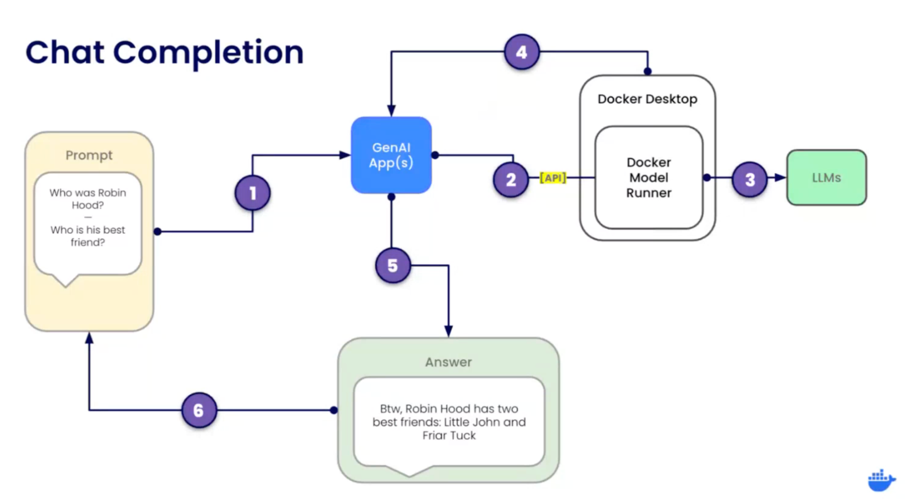

# Introduction to Gen AI
### Docker Model Runner
Run GenAI Model Locally

> [Docker Model Registry](https://hub.docker.com/u/ai)

#### Key Features
- **Simple Local Model Execution**: based on llama.cpp, OpenAI API compliant
- **GPU Acceleration**:
  - At the beginning: It offers GPU acceleration on Apple silicon
  - Now: Windows+Nvidia
- **Standardized Model Packaging**: Open Container Initiative (OCI) Artifacts

#### Future Plans
- **More platforms**: Linux, Docker CE
- **Ability to customize and publish your own models**
- **Better integration with development workflows** (including Compose and Testcontainers)

<br><br><br>


## Docker Model Runner (`docker model`)
- Avaialble with Docker Desktop 4.40
- Make sure Docker Destop is running prior to execution of any commands below.
- Use `docker model list` command to view the list of downloaded OCI artifacts available locally
- Pull AI OCI models with `docker model pull <image_name>` eg. `docker model pull ai/llama3.2`
- Run docker AI model with `docker model run ai/llama3.2`
- Quick chat with `/bye`
- You can also start/stop models from Docker Desktop. Navigate to **Models** section of side panel and start/stop downloaded model.

<br><br><br>

## Docker Chat Completion App
An AI chat completion app is a software application that utilizes artificial intelligence to generate conversational responses based on user input.<br>It's designed to simulate a back-and-forth dialogue, maintaining context across multiple messages to create a natural-feeling interaction.<br>These apps are often used to build chatbots, autonomous agents, or to add AI-powered chat functionality to other applications. 




```go
messages := []openai.ChatCompletionMessageParamUnion{
  openai.SystemMessage("You are useful AI agent expert with TV series.")
  openai.UserMessage("Tell me about the English series called The Avengers?")
}

params := openai.ChatCompletionNewParams{
  Message: message,
  Model: model,
  Temperature: openai.Opt(0.8)
}

completion, err := client.Chat.Completion.New(ctx, params)
```